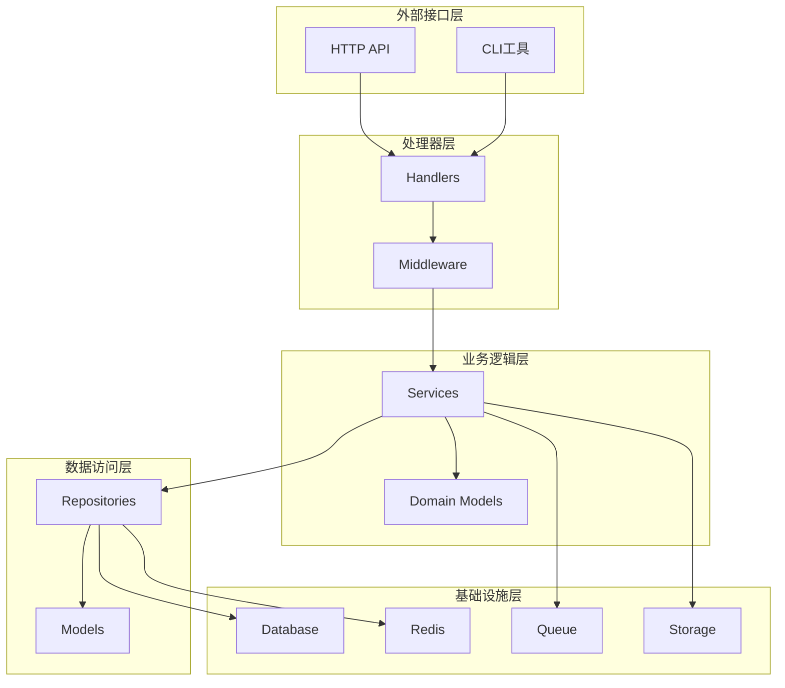
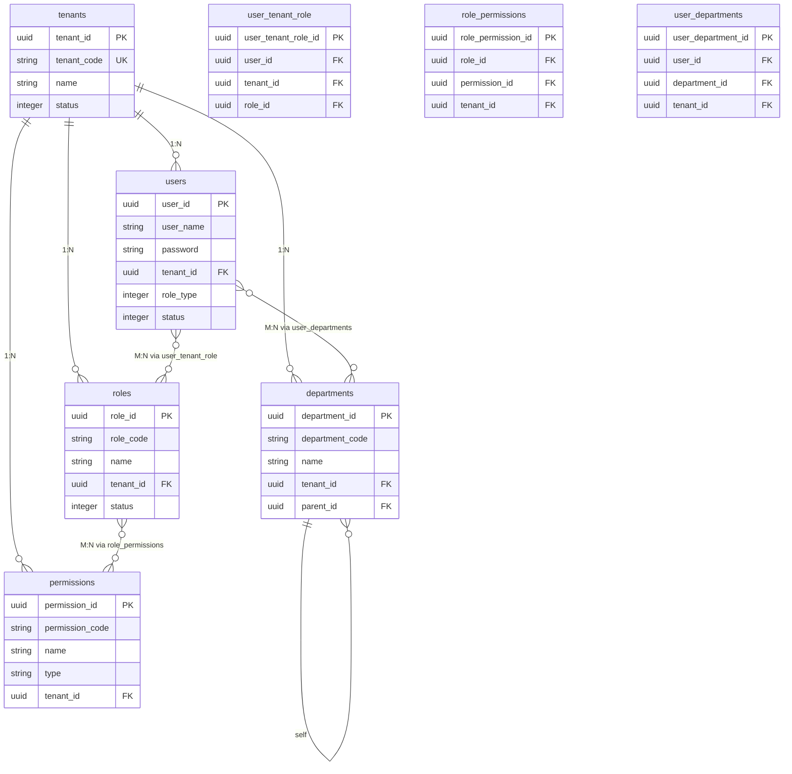

# 多租户SaaS管理后端架构设计

## 项目概述

本项目是一个基于Go语言开发的企业级多租户SaaS管理后端系统，采用清洁架构设计模式，支持多租户隔离、基于角色的权限控制（RBAC）、JWT认证授权等核心功能。

### 技术栈

- **Web框架**：Gin v1.11.0
- **ORM框架**：GORM v1.31.1 配合 GORM Gen 进行代码生成
- **数据库**：PostgreSQL，支持软删除和多租户数据隔离
- **身份认证**：JWT 双令牌机制 配合 Redis 黑名单
- **权限授权**：Casbin RBAC，支持多租户（域）
- **缓存**：Redis 用于令牌管理、数据缓存和会话存储
- **日志**：Zerolog 结构化日志
- **配置**：Viper 支持环境感知的配置管理

## 1. 项目架构设计

### 1.1 整体架构

本项目采用**清洁架构（Clean Architecture）**模式，严格分层设计：



### 1.2 目录结构设计

```
backend/
├── cmd/                           # 应用程序入口点
│   ├── server/                    # HTTP API服务器
│   │   └── main.go               # 主入口文件
│   ├── worker/                   # 后台任务处理器
│   └── cli/                      # 命令行工具
│
├── internal/                     # 内部包（不对外暴露）
│   ├── constants/                # 常量定义
│   ├── dal/                      # 数据访问层
│   │   ├── model/                # 数据模型（GORM生成）
│   │   └── query/                # 查询接口（GORM Gen生成）
│   ├── dto/                      # 数据传输对象
│   ├── handler/                  # HTTP处理器层
│   ├── middleware/               # HTTP中间件
│   ├── repository/               # 仓库层（数据访问实现）
│   ├── service/                  # 业务逻辑层
│   ├── domain/                   # 领域模型层（DDD）
│   └── router/                   # 路由层
│
├── pkg/                          # 可复用包
│   ├── auth/                     # 认证包
│   ├── cache/                    # 缓存包
│   ├── config/                   # 配置包
│   ├── database/                 # 数据库包
│   ├── errors/                   # 错误处理包
│   ├── logger/                   # 日志包
│   ├── queue/                    # 消息队列包
│   ├── storage/                  # 存储包
│   ├── utils/                    # 工具包
│   └── response/                 # 响应包
│
├── config/                       # 配置文件
├── migrations/                   # 数据库迁移文件
├── test/                         # 测试文件
├── docs/                         # 文档目录
├── scripts/                      # 脚本文件
├── deployments/                  # 部署配置
└── static/                       # 静态文件目录
```

### 1.3 分层架构原则

1. **依赖倒置**：高层模块不依赖低层模块，都依赖抽象
2. **单一职责**：每个模块只负责一个功能领域
3. **开闭原则**：对扩展开放，对修改关闭
4. **接口隔离**：使用小而专一的接口

## 2. 数据库设计

### 2.1 核心数据模型

#### 2.1.1 租户表 (tenants)

```sql
CREATE TABLE tenants (
    tenant_id UUID PRIMARY KEY DEFAULT gen_random_uuid(),
    tenant_code VARCHAR(50) NOT NULL UNIQUE,
    name VARCHAR(200) NOT NULL,
    description TEXT,
    logo_url VARCHAR(500),
    domain VARCHAR(100),
    contact_name VARCHAR(100),
    contact_phone VARCHAR(20),
    contact_email VARCHAR(255),
    address TEXT,
    status SMALLINT NOT NULL DEFAULT 1,
    tier SMALLINT NOT NULL DEFAULT 1,
    max_users INTEGER DEFAULT 100,
    max_storage BIGINT DEFAULT 10737418240,
    expire_time BIGINT,
    settings JSONB DEFAULT '{}',
    created_at BIGINT NOT NULL,
    updated_at BIGINT NOT NULL,
    deleted_at BIGINT DEFAULT 0
);
```

#### 2.1.2 用户表 (users)

```sql
CREATE TABLE users (
    user_id UUID PRIMARY KEY DEFAULT gen_random_uuid(),
    user_name VARCHAR(255) NOT NULL,
    password VARCHAR(255) NOT NULL,
    salt VARCHAR(64) NOT NULL,
    name VARCHAR(255) NOT NULL DEFAULT '',
    avatar VARCHAR(500),
    phone VARCHAR(20),
    email VARCHAR(255),
    tenant_id UUID NOT NULL,
    role_type INTEGER NOT NULL DEFAULT 1,
    status INTEGER NOT NULL DEFAULT 1,
    remark TEXT,
    last_login_time BIGINT,
    last_login_ip INET,
    login_count INTEGER DEFAULT 0,
    password_updated_at BIGINT,
    email_verified BOOLEAN DEFAULT FALSE,
    phone_verified BOOLEAN DEFAULT FALSE,
    two_factor_enabled BOOLEAN DEFAULT FALSE,
    two_factor_secret VARCHAR(64),
    preferences JSONB DEFAULT '{}',
    created_at BIGINT NOT NULL,
    updated_at BIGINT NOT NULL,
    deleted_at BIGINT DEFAULT 0,

    UNIQUE(tenant_id, user_name) WHERE deleted_at = 0
);
```

#### 2.1.3 角色表 (roles)

```sql
CREATE TABLE roles (
    role_id UUID PRIMARY KEY DEFAULT gen_random_uuid(),
    tenant_id UUID NOT NULL,
    role_code VARCHAR(50) NOT NULL,
    name VARCHAR(100) NOT NULL,
    description TEXT,
    status INTEGER NOT NULL DEFAULT 1,
    is_system BOOLEAN DEFAULT FALSE,
    is_default BOOLEAN DEFAULT FALSE,
    parent_role_id UUID,
    level SMALLINT DEFAULT 1,
    permissions JSONB DEFAULT '[]',
    created_at BIGINT NOT NULL,
    updated_at BIGINT NOT NULL,
    deleted_at BIGINT DEFAULT 0,

    UNIQUE(tenant_id, role_code) WHERE deleted_at = 0
);
```

#### 2.1.4 权限表 (permissions)

```sql
CREATE TABLE permissions (
    permission_id UUID PRIMARY KEY DEFAULT gen_random_uuid(),
    tenant_id UUID,
    permission_code VARCHAR(100) NOT NULL,
    name VARCHAR(100) NOT NULL,
    type VARCHAR(20) NOT NULL,
    category VARCHAR(50),
    resource VARCHAR(500),
    action VARCHAR(50),
    method VARCHAR(10),
    parent_id UUID,
    sort INTEGER DEFAULT 0,
    icon VARCHAR(100),
    component VARCHAR(200),
    is_hidden BOOLEAN DEFAULT FALSE,
    is_system BOOLEAN DEFAULT FALSE,
    description TEXT,
    created_at BIGINT NOT NULL,
    updated_at BIGINT NOT NULL,
    deleted_at BIGINT DEFAULT 0,

    UNIQUE(tenant_id, permission_code) WHERE deleted_at = 0
);
```

### 2.2 业务扩展表

#### 2.2.1 部门组织架构表

```sql
CREATE TABLE departments (
    department_id UUID PRIMARY KEY DEFAULT gen_random_uuid(),
    tenant_id UUID NOT NULL,
    parent_id UUID,
    department_code VARCHAR(50) NOT NULL,
    name VARCHAR(200) NOT NULL,
    description TEXT,
    leader_id UUID,
    sort INTEGER DEFAULT 0,
    level INTEGER DEFAULT 1,
    path VARCHAR(1000),
    status INTEGER NOT NULL DEFAULT 1,
    created_at BIGINT NOT NULL,
    updated_at BIGINT NOT NULL,
    deleted_at BIGINT DEFAULT 0
);
```

#### 2.2.2 文件管理表

```sql
CREATE TABLE files (
    file_id UUID PRIMARY KEY DEFAULT gen_random_uuid(),
    tenant_id UUID NOT NULL,
    file_name VARCHAR(500) NOT NULL,
    original_name VARCHAR(500) NOT NULL,
    file_path VARCHAR(1000) NOT NULL,
    file_size BIGINT NOT NULL,
    file_type VARCHAR(100) NOT NULL,
    mime_type VARCHAR(200),
    md5_hash VARCHAR(32),
    sha256_hash VARCHAR(64),
    storage_type VARCHAR(20) DEFAULT 'local',
    storage_config JSONB,
    upload_user_id UUID NOT NULL,
    upload_ip INET,
    is_public BOOLEAN DEFAULT FALSE,
    download_count INTEGER DEFAULT 0,
    last_download_time BIGINT,
    expire_time BIGINT,
    status INTEGER NOT NULL DEFAULT 1,
    created_at BIGINT NOT NULL,
    updated_at BIGINT NOT NULL,
    deleted_at BIGINT DEFAULT 0
);
```

### 2.3 ER关系图



### 2.4 多租户隔离策略

#### 2.4.1 字段隔离模式
- 所有业务表包含 `tenant_id` 字段
- 复合唯一约束 `(tenant_id, business_key)`
- GORM Callbacks 自动注入租户过滤条件

#### 2.4.2 数据库层面隔离
```sql
-- 租户级数据过滤
CREATE POLICY tenant_isolation_policy ON users
FOR ALL TO application_user
USING (tenant_id = current_setting('app.current_tenant_id')::UUID);
```

## 3. API接口设计

### 3.1 API设计原则

- **RESTful设计**：资源导向的API设计
- **版本控制**：通过URL路径进行版本控制 `/api/v1/`
- **统一响应格式**：标准化的JSON响应结构
- **HTTP语义化**：正确使用HTTP方法和状态码

### 3.2 认证授权API

#### 3.2.1 用户登录

```http
POST /api/v1/auth/login
Content-Type: application/json

{
  "tenant_code": "demo",
  "user_name": "admin",
  "password": "123456",
  "captcha_id": "abc123",
  "captcha_code": "XYZ9"
}
```

**响应：**
```json
{
  "code": 200,
  "message": "登录成功",
  "data": {
    "access_token": "eyJhbGciOiJIUzI1NiIsInR5cCI6IkpXVCJ9...",
    "refresh_token": "eyJhbGciOiJIUzI1NiIsInR5cCI6IkpXVCJ9...",
    "expires_in": 3600,
    "user_info": {
      "user_id": "550e8400-e29b-41d4-a716-446655440000",
      "user_name": "admin",
      "name": "管理员",
      "tenant_id": "550e8400-e29b-41d4-a716-446655440001",
      "tenant_code": "demo",
      "roles": ["admin"],
      "permissions": ["*:*"]
    }
  }
}
```

#### 3.2.2 刷新令牌

```http
POST /api/v1/auth/refresh
Content-Type: application/json

{
  "refresh_token": "eyJhbGciOiJIUzI1NiIsInR5cCI6IkpXVCJ9..."
}
```

### 3.3 用户管理API

#### 3.3.1 用户列表查询

```http
GET /api/v1/users?page=1&page_size=20&keyword=admin&role_id=xxx&status=1
Authorization: Bearer {access_token}
```

**响应：**
```json
{
  "code": 200,
  "message": "success",
  "data": {
    "items": [
      {
        "user_id": "550e8400-e29b-41d4-a716-446655440000",
        "user_name": "admin",
        "name": "管理员",
        "email": "admin@example.com",
        "phone": "13800138000",
        "avatar": "https://example.com/avatar.jpg",
        "status": 1,
        "role_type": 2,
        "created_at": 1640995200000,
        "updated_at": 1640995200000
      }
    ],
    "total": 1,
    "page": 1,
    "page_size": 20
  }
}
```

#### 3.3.2 创建用户

```http
POST /api/v1/users
Content-Type: application/json
Authorization: Bearer {access_token}

{
  "user_name": "newuser",
  "name": "新用户",
  "password": "123456",
  "email": "newuser@example.com",
  "phone": "13900139000",
  "role_ids": ["role_id_1"],
  "department_ids": ["dept_id_1"]
}
```

### 3.4 租户管理API

#### 3.4.1 创建租户

```http
POST /api/v1/tenants
Content-Type: application/json
Authorization: Bearer {access_token}

{
  "tenant_code": "newtenant",
  "name": "新租户",
  "description": "租户描述",
  "contact_name": "联系人",
  "contact_phone": "13800138000",
  "contact_email": "contact@example.com",
  "tier": 1,
  "max_users": 100
}
```

### 3.5 统一响应格式

#### 3.5.1 成功响应

```json
{
  "code": 200,
  "message": "success",
  "data": {
    // 具体数据
  },
  "timestamp": 1640995200000,
  "request_id": "req_123456789"
}
```

#### 3.5.2 错误响应

```json
{
  "code": 40001,
  "message": "参数验证失败",
  "data": null,
  "errors": [
    {
      "field": "user_name",
      "message": "用户名不能为空"
    }
  ],
  "timestamp": 1640995200000,
  "request_id": "req_123456789"
}
```

#### 3.5.3 分页响应

```json
{
  "code": 200,
  "message": "success",
  "data": {
    "items": [...],
    "total": 100,
    "page": 1,
    "page_size": 20,
    "total_pages": 5
  }
}
```

## 4. 核心功能实现

### 4.1 多租户数据隔离实现

#### 4.1.1 租户上下文管理

```go
// TenantContext 租户上下文
type TenantContext struct {
    TenantID   string
    TenantCode string
    UserID     string
    Roles      []string
}

// GetTenantFromContext 从上下文获取租户信息
func GetTenantFromContext(c *gin.Context) *TenantContext {
    if tenant, exists := c.Get("tenant"); exists {
        return tenant.(*TenantContext)
    }
    return nil
}

// WithTenantScope 注入租户作用域
func WithTenantScope(db *gorm.DB, tenantID string) *gorm.DB {
    return db.WithContext(context.WithValue(context.Background(), "tenant_id", tenantID))
}
```

#### 4.1.2 GORM Callbacks 自动过滤

```go
// SetupTenantCallbacks 设置租户相关回调
func SetupTenantCallbacks(db *gorm.DB) {
    db.Callback().Query().Before("gorm:query").Register("tenant_filter", tenantQueryCallback)
    db.Callback().Create().Before("gorm:create").Register("tenant_create", tenantCreateCallback)
    db.Callback().Update().Before("gorm:update").Register("tenant_update", tenantUpdateCallback)
    db.Callback().Delete().Before("gorm:delete").Register("tenant_delete", tenantDeleteCallback)
}

func tenantQueryCallback(db *gorm.DB) {
    if shouldSkipTenantCheck(db) {
        return
    }

    tenantID := getTenantIDFromContext(db)
    if tenantID != "" {
        db.Statement.AddClause(clause.Where{
            Exprs: []clause.Expression{
                clause.Eq{Column: "tenant_id", Value: tenantID},
                clause.Eq{Column: "deleted_at", Value: 0},
            },
        })
    }
}
```

### 4.2 JWT双令牌认证机制

#### 4.2.1 JWT管理器实现

```go
// JWTManager JWT令牌管理器
type JWTManager struct {
    secretKey        string
    accessExpire     time.Duration
    refreshExpire    time.Duration
    issuer           string
    blacklist        BlacklistManager
}

// TokenPair 令牌对
type TokenPair struct {
    AccessToken  string `json:"access_token"`
    RefreshToken string `json:"refresh_token"`
    ExpiresIn    int64  `json:"expires_in"`
}

// GenerateTokenPair 生成令牌对
func (j *JWTManager) GenerateTokenPair(user *User, tenant *Tenant) (*TokenPair, error) {
    // 生成 Access Token
    accessToken, err := j.generateAccessToken(user, tenant)
    if err != nil {
        return nil, err
    }

    // 生成 Refresh Token
    refreshToken, err := j.generateRefreshToken(user, tenant)
    if err != nil {
        return nil, err
    }

    return &TokenPair{
        AccessToken:  accessToken,
        RefreshToken: refreshToken,
        ExpiresIn:    int64(j.accessExpire.Seconds()),
    }, nil
}

// generateAccessToken 生成访问令牌
func (j *JWTManager) generateAccessToken(user *User, tenant *Tenant) (string, error) {
    now := time.Now()
    claims := &Claims{
        UserID:      user.UserID,
        UserName:    user.UserName,
        TenantID:    tenant.TenantID,
        TenantCode:  tenant.TenantCode,
        Roles:       user.Roles,
        Permissions: user.Permissions,
        TokenID:     uuid.New().String(),
        Type:        "access",
        StandardClaims: jwt.StandardClaims{
            Issuer:    j.issuer,
            Subject:   user.UserID,
            Audience:  tenant.TenantCode,
            ExpiresAt: now.Add(j.accessExpire).Unix(),
            IssuedAt:  now.Unix(),
            NotBefore: now.Unix(),
        },
    }

    return j.generateToken(claims)
}
```

#### 4.2.2 黑名单管理

```go
// BlacklistManager 黑名单管理器
type BlacklistManager struct {
    redis   redis.UniversalClient
    keyPrefix string
}

// AddToBlacklist 将令牌加入黑名单
func (b *BlacklistManager) AddToBlacklist(ctx context.Context, tokenID string, ttl int64) error {
    key := b.keyPrefix + tokenID
    return b.redis.Set(ctx, key, "1", time.Duration(ttl)*time.Second).Err()
}

// IsBlacklisted 检查令牌是否在黑名单
func (b *BlacklistManager) IsBlacklisted(ctx context.Context, tokenID string) (bool, error) {
    key := b.keyPrefix + tokenID
    exists, err := b.redis.Exists(ctx, key).Result()
    return exists > 0, err
}
```

### 4.3 Casbin RBAC权限控制

#### 4.3.1 权限模型配置

```conf
# rbac_model.conf
[request_definition]
r = sub, dom, obj, act

[policy_definition]
p = sub, dom, obj, act

[role_definition]
g = _, _, _
g2 = _, _

[policy_effect]
e = some(where (p.eft == allow))

[matchers]
m = g(r.sub, p.sub, r.dom) && r.dom == p.dom && regexMatch(r.obj, p.obj) && regexMatch(r.act, p.act)
```

#### 4.3.2 策略管理器

```go
// PolicyManager 策略管理器
type PolicyManager struct {
    enforcer *casbin.Enforcer
    cache    redis.UniversalClient
}

// AddPolicy 添加权限策略
func (p *PolicyManager) AddPolicy(ctx context.Context, role, tenant, resource, action string) error {
    success, err := p.enforcer.AddPolicy(role, tenant, resource, action)
    if err != nil {
        return err
    }

    if success {
        // 清除相关缓存
        p.clearPolicyCache(ctx, tenant)
        // 保存到数据库
        return p.savePolicyToDB(ctx, role, tenant, resource, action)
    }

    return nil
}

// BatchUpdatePolicies 批量更新策略
func (p *PolicyManager) BatchUpdatePolicies(ctx context.Context, policies [][]string) error {
    // 开启事务
    tx := p.enforcer.GetAdapter().(*DatabaseAdapter).BeginTx()

    // 清除旧策略
    p.enforcer.RemoveFilteredPolicy(0, "", "", "", "")

    // 添加新策略
    _, err := p.enforcer.AddPolicies(policies)
    if err != nil {
        tx.Rollback()
        return err
    }

    // 提交事务
    return tx.Commit()
}
```

### 4.4 Redis缓存策略

#### 4.4.1 缓存管理器

```go
// CacheManager 缓存管理器
type CacheManager struct {
    redis     redis.UniversalClient
    keyPrefix string
    marshal   func(interface{}) ([]byte, error)
    unmarshal func([]byte, interface{}) error
}

// 缓存键定义
const (
    UserCacheKey       = "user:{tenant_id}:{user_id}"
    UserRoleCacheKey   = "user:roles:{tenant_id}:{user_id}"
    PermissionCacheKey = "perm:{tenant_id}:{user_id}"
    PolicyCacheKey     = "policy:{tenant_id}"
)

// SetUserCache 设置用户缓存
func (c *CacheManager) SetUserCache(ctx context.Context, user *User) error {
    key := fmt.Sprintf(UserCacheKey, user.TenantID, user.UserID)
    data, err := c.marshal(user)
    if err != nil {
        return err
    }

    return c.redis.Set(ctx, key, data, time.Hour).Err()
}

// GetUserCache 获取用户缓存
func (c *CacheManager) GetUserCache(ctx context.Context, tenantID, userID string) (*User, error) {
    key := fmt.Sprintf(UserCacheKey, tenantID, userID)
    data, err := c.redis.Get(ctx, key).Result()
    if err != nil {
        if err == redis.Nil {
            return nil, ErrCacheNotFound
        }
        return nil, err
    }

    var user User
    err = c.unmarshal([]byte(data), &user)
    return &user, err
}
```

#### 4.4.2 缓存更新策略

```go
// InvalidateUserCache 清除用户相关缓存
func (c *CacheManager) InvalidateUserCache(ctx context.Context, tenantID, userID string) error {
    pattern := fmt.Sprintf("*:{%s}:{%s}", tenantID, userID)

    keys, err := c.redis.Keys(ctx, pattern).Result()
    if err != nil {
        return err
    }

    if len(keys) > 0 {
        return c.redis.Del(ctx, keys...).Err()
    }

    return nil
}
```

### 4.5 中间件链设计

#### 4.5.1 完整中间件链

```go
// SetupMiddleware 设置中间件链
func SetupMiddleware(r *gin.Engine, app *App) {
    // 1. 请求ID生成（链路追踪）
    r.Use(middleware.RequestIDMiddleware())

    // 2. 日志记录（请求开始时间）
    r.Use(middleware.LoggerMiddleware())

    // 3. 异常恢复
    r.Use(middleware.RecoveryMiddleware())

    // 4. CORS配置
    r.Use(middleware.CORSMiddleware())

    // 5. 限流控制
    if app.Config.RateLimit.Enabled {
        r.Use(middleware.RateLimitMiddleware(app.Redis))
    }

    // 6. 租户上下文提取
    r.Use(middleware.TenantMiddleware())

    // 7. JWT认证
    r.Use(middleware.AuthMiddleware(app.JWT))

    // 8. Casbin权限控制
    r.Use(middleware.CasbinMiddleware(app.Enforcer))
}
```

#### 4.5.2 认证中间件实现

```go
// AuthMiddleware JWT认证中间件
func AuthMiddleware(jwtManager *JWTManager) gin.HandlerFunc {
    return func(c *gin.Context) {
        // 跳过公开路径
        if isPublicPath(c.Request.URL.Path) {
            c.Next()
            return
        }

        // 提取Authorization头
        authHeader := c.GetHeader("Authorization")
        if authHeader == "" {
            response.Error(c, xerr.ErrUnauthorized)
            c.Abort()
            return
        }

        // 解析Bearer Token
        tokenStr := strings.TrimPrefix(authHeader, "Bearer ")
        if tokenStr == authHeader {
            response.Error(c, xerr.ErrInvalidToken)
            c.Abort()
            return
        }

        // 验证令牌
        claims, err := jwtManager.ValidateToken(tokenStr)
        if err != nil {
            response.Error(c, xerr.ErrInvalidToken)
            c.Abort()
            return
        }

        // 检查黑名单
        if jwtManager.IsBlacklisted(c.Request.Context(), claims.TokenID) {
            response.Error(c, xerr.ErrTokenBlacklisted)
            c.Abort()
            return
        }

        // 将用户信息存入上下文
        c.Set("user_id", claims.UserID)
        c.Set("user_name", claims.UserName)
        c.Set("tenant_id", claims.TenantID)
        c.Set("tenant_code", claims.TenantCode)
        c.Set("roles", claims.Roles)
        c.Set("permissions", claims.Permissions)

        c.Next()
    }
}
```

#### 4.5.3 权限控制中间件

```go
// CasbinMiddleware Casbin权限控制中间件
func CasbinMiddleware(enforcer *casbin.Enforcer) gin.HandlerFunc {
    return func(c *gin.Context) {
        // 获取用户信息
        userID := c.GetString("user_id")
        tenantID := c.GetString("tenant_id")
        if userID == "" || tenantID == "" {
            response.Error(c, xerr.ErrUnauthorized)
            c.Abort()
            return
        }

        // 构建权限检查参数
        obj := c.Request.URL.Path
        act := c.Request.Method

        // 检查权限
        allowed, err := enforcer.Enforce(userID, tenantID, obj, act)
        if err != nil {
            log.Error().Err(err).Msg("权限检查失败")
            response.Error(c, xerr.ErrInternal)
            c.Abort()
            return
        }

        if !allowed {
            log.Warn().
                Str("user_id", userID).
                Str("tenant_id", tenantID).
                Str("resource", obj).
                Str("action", act).
                Msg("权限不足")
            response.Error(c, xerr.ErrPermissionDenied)
            c.Abort()
            return
        }

        c.Next()
    }
}
```

### 4.6 配置管理方案

#### 4.6.1 配置结构定义

```go
// Config 应用配置
type Config struct {
    App      AppConfig      `mapstructure:"app" yaml:"app"`
    Database DatabaseConfig `mapstructure:"database" yaml:"database"`
    Redis    RedisConfig    `mapstructure:"redis" yaml:"redis"`
    JWT      JWTConfig      `mapstructure:"jwt" yaml:"jwt"`
    Log      LogConfig      `mapstructure:"log" yaml:"log"`
    RateLimit RateLimitConfig `mapstructure:"rate_limit" yaml:"rate_limit"`
}

// AppConfig 应用配置
type AppConfig struct {
    Name string `mapstructure:"name" yaml:"name"`
    Port int    `mapstructure:"port" yaml:"port"`
    Env  string `mapstructure:"env" yaml:"env"`
}

// DatabaseConfig 数据库配置
type DatabaseConfig struct {
    Host            string `mapstructure:"host" yaml:"host"`
    Port            int    `mapstructure:"port" yaml:"port"`
    DBName          string `mapstructure:"dbname" yaml:"dbname"`
    User            string `mapstructure:"user" yaml:"user"`
    Password        string `mapstructure:"password" yaml:"password"`
    SSLMode         string `mapstructure:"sslmode" yaml:"sslmode"`
    MaxIdleConns    int    `mapstructure:"max_idle_conns" yaml:"max_idle_conns"`
    MaxOpenConns    int    `mapstructure:"max_open_conns" yaml:"max_open_conns"`
    ConnMaxLifetime int    `mapstructure:"conn_max_lifetime" yaml:"conn_max_lifetime"`
}
```

#### 4.6.2 配置加载实现

```go
// LoadConfig 加载配置
func LoadConfig(configPath string) (*Config, error) {
    viper.SetConfigFile(configPath)
    viper.SetConfigType("yaml")

    // 设置环境变量前缀
    viper.SetEnvPrefix("ADMIN")
    viper.AutomaticEnv()

    // 读取配置文件
    if err := viper.ReadInConfig(); err != nil {
        return nil, fmt.Errorf("读取配置文件失败: %w", err)
    }

    // 加载环境特定配置
    env := viper.GetString("app.env")
    if env != "" {
        envConfigPath := filepath.Join(filepath.Dir(configPath), fmt.Sprintf("config.%s.yaml", env))
        if _, err := os.Stat(envConfigPath); err == nil {
            viper.SetConfigFile(envConfigPath)
            if err := viper.MergeInConfig(); err != nil {
                return nil, fmt.Errorf("合并环境配置失败: %w", err)
            }
        }
    }

    // 解析配置
    var config Config
    if err := viper.Unmarshal(&config); err != nil {
        return nil, fmt.Errorf("解析配置失败: %w", err)
    }

    // 验证配置
    if err := validateConfig(&config); err != nil {
        return nil, fmt.Errorf("配置验证失败: %w", err)
    }

    return &config, nil
}
```

### 4.7 日志和监控方案

#### 4.7.1 结构化日志

```go
// Logger 日志配置
type Logger struct {
    zerolog.Logger
}

// NewLogger 创建新的日志实例
func NewLogger(config LogConfig) *Logger {
    output := os.Stdout
    if config.Output == "file" && config.File != "" {
        file, err := os.OpenFile(config.File, os.O_CREATE|os.O_WRONLY|os.O_APPEND, 0666)
        if err == nil {
            output = file
        }
    }

    var logger zerolog.Logger
    if config.Format == "console" {
        logger = zerolog.New(zerolog.ConsoleWriter{Out: output})
    } else {
        logger = zerolog.New(output)
    }

    level, _ := zerolog.ParseLevel(config.Level)
    logger = logger.Level(level).With().Timestamp().Caller().Logger()

    return &Logger{Logger: logger}
}

// LogRequest 记录请求日志
func (l *Logger) LogRequest(c *gin.Context, duration time.Duration) {
    l.Info().
        Str("request_id", c.GetString("request_id")).
        Str("method", c.Request.Method).
        Str("path", c.Request.URL.Path).
        Str("client_ip", c.ClientIP()).
        Str("user_agent", c.Request.UserAgent()).
        Int("status", c.Writer.Status()).
        Dur("duration", duration).
        Str("tenant_id", c.GetString("tenant_id")).
        Str("user_id", c.GetString("user_id")).
        Msg("HTTP请求")
}
```

#### 4.7.2 性能监控

```go
// MetricsCollector 指标收集器
type MetricsCollector struct {
    requestsTotal    *prometheus.CounterVec
    requestDuration  *prometheus.HistogramVec
    errorTotal       *prometheus.CounterVec
    activeConnections prometheus.Gauge
}

// NewMetricsCollector 创建指标收集器
func NewMetricsCollector() *MetricsCollector {
    return &MetricsCollector{
        requestsTotal: prometheus.NewCounterVec(
            prometheus.CounterOpts{
                Name: "http_requests_total",
                Help: "HTTP请求总数",
            },
            []string{"method", "path", "status", "tenant_id"},
        ),
        requestDuration: prometheus.NewHistogramVec(
            prometheus.HistogramOpts{
                Name:    "http_request_duration_seconds",
                Help:    "HTTP请求持续时间",
                Buckets: prometheus.DefBuckets,
            },
            []string{"method", "path", "tenant_id"},
        ),
        errorTotal: prometheus.NewCounterVec(
            prometheus.CounterOpts{
                Name: "http_errors_total",
                Help: "HTTP错误总数",
            },
            []string{"method", "path", "error_code", "tenant_id"},
        ),
        activeConnections: prometheus.NewGauge(
            prometheus.GaugeOpts{
                Name: "active_connections",
                Help: "活跃连接数",
            },
        ),
    }
}
```

## 5. 安全性设计

### 5.1 认证安全

#### 5.1.1 密码安全策略

```go
// PasswordService 密码服务
type PasswordService struct {
    pepper string
}

// HashPassword 哈希密码
func (p *PasswordService) HashPassword(password string) (string, error) {
    // 生成随机盐值
    salt := make([]byte, 16)
    if _, err := rand.Read(salt); err != nil {
        return "", err
    }

    // 加盐哈希
    saltedPassword := append([]byte(password), salt...)
    saltedPassword = append(saltedPassword, []byte(p.pepper)...)

    hash, err := bcrypt.GenerateFromPassword(saltedPassword, bcrypt.DefaultCost)
    if err != nil {
        return "", err
    }

    return string(hash), nil
}

// VerifyPassword 验证密码
func (p *PasswordService) VerifyPassword(password, hash string) bool {
    saltedPassword := append([]byte(password), []byte(p.pepper)...)
    err := bcrypt.CompareHashAndPassword([]byte(hash), saltedPassword)
    return err == nil
}
```

#### 5.1.2 多因素认证

```go
// TwoFactorService 两步验证服务
type TwoFactorService struct {
    issuer string
}

// GenerateSecret 生成两步验证密钥
func (t *TwoFactorService) GenerateSecret(user *User) (string, error) {
    key, err := totp.Generate(totp.GenerateOpts{
        Issuer:      t.issuer,
        AccountName: user.UserName,
        SecretSize:  32,
    })
    if err != nil {
        return "", err
    }

    return key.Secret(), nil
}

// ValidateCode 验证两步验证码
func (t *TwoFactorService) ValidateCode(user *User, code string) bool {
    if user.TwoFactorSecret == "" {
        return false
    }

    return totp.Validate(code, user.TwoFactorSecret)
}
```

### 5.2 数据安全

#### 5.2.1 敏感数据加密

```go
// EncryptionService 加密服务
type EncryptionService struct {
    key []byte
}

// EncryptField 加密字段
func (e *EncryptionService) EncryptField(plaintext string) (string, error) {
    block, err := aes.NewCipher(e.key)
    if err != nil {
        return "", err
    }

    gcm, err := cipher.NewGCM(block)
    if err != nil {
        return "", err
    }

    nonce := make([]byte, gcm.NonceSize())
    if _, err = io.ReadFull(rand.Reader, nonce); err != nil {
        return "", err
    }

    ciphertext := gcm.Seal(nonce, nonce, []byte(plaintext), nil)
    return base64.StdEncoding.EncodeToString(ciphertext), nil
}

// DecryptField 解密字段
func (e *EncryptionService) DecryptField(ciphertext string) (string, error) {
    data, err := base64.StdEncoding.DecodeString(ciphertext)
    if err != nil {
        return "", err
    }

    block, err := aes.NewCipher(e.key)
    if err != nil {
        return "", err
    }

    gcm, err := cipher.NewGCM(block)
    if err != nil {
        return "", err
    }

    nonceSize := gcm.NonceSize()
    if len(data) < nonceSize {
        return "", errors.New("ciphertext too short")
    }

    nonce, ciphertext := data[:nonceSize], data[nonceSize:]
    plaintext, err := gcm.Open(nil, nonce, ciphertext, nil)
    if err != nil {
        return "", err
    }

    return string(plaintext), nil
}
```

### 5.3 API安全

#### 5.3.1 输入验证

```go
// ValidationMiddleware 输入验证中间件
func ValidationMiddleware() gin.HandlerFunc {
    return func(c *gin.Context) {
        // 请求大小限制
        if c.Request.ContentLength > 10*1024*1024 { // 10MB
            response.Error(c, xerr.NewRequestTooLarge)
            c.Abort()
            return
        }

        // SQL注入检测
        if isSQLInjection(c) {
            log.Warn().Str("ip", c.ClientIP()).Msg("检测到SQL注入攻击")
            response.Error(c, xerr.ErrInvalidRequest)
            c.Abort()
            return
        }

        // XSS攻击检测
        if isXSSAttack(c) {
            log.Warn().Str("ip", c.ClientIP()).Msg("检测到XSS攻击")
            response.Error(c, xerr.ErrInvalidRequest)
            c.Abort()
            return
        }

        c.Next()
    }
}
```

#### 5.3.2 频率限制

```go
// RateLimitMiddleware 限流中间件
func RateLimitMiddleware(redis redis.UniversalClient) gin.HandlerFunc {
    limiter := rate.NewLimiter(rate.Limit(100), 200) // 100 requests per second, burst 200

    return func(c *gin.Context) {
        // 基于IP的限流
        ipKey := fmt.Sprintf("rate_limit:ip:%s", c.ClientIP())
        count, err := redis.Incr(c.Request.Context(), ipKey).Result()
        if err == nil {
            if count == 1 {
                redis.Expire(c.Request.Context(), ipKey, time.Second)
            }
            if count > 100 {
                response.Error(c, xerr.ErrTooManyRequests)
                c.Abort()
                return
            }
        }

        // 基于用户的限流
        if userID := c.GetString("user_id"); userID != "" {
            userKey := fmt.Sprintf("rate_limit:user:%s", userID)
            count, err := redis.Incr(c.Request.Context(), userKey).Result()
            if err == nil {
                if count == 1 {
                    redis.Expire(c.Request.Context(), userKey, time.Minute)
                }
                if count > 1000 { // 用户每分钟1000次请求
                    response.Error(c, xerr.ErrTooManyRequests)
                    c.Abort()
                    return
                }
            }
        }

        c.Next()
    }
}
```

## 6. 性能优化

### 6.1 数据库优化

#### 6.1.1 连接池配置

```go
// SetupDB 设置数据库连接
func SetupDB(config DatabaseConfig) (*gorm.DB, error) {
    dsn := fmt.Sprintf("host=%s port=%d dbname=%s user=%s password=%s sslmode=%s",
        config.Host, config.Port, config.DBName, config.User, config.Password, config.SSLMode)

    db, err := gorm.Open(postgres.Open(dsn), &gorm.Config{
        Logger: logger.Default.LogMode(logger.Info),
        NamingStrategy: schema.NamingStrategy{
            TablePrefix:   "",
            SingularTable: false,
        },
    })
    if err != nil {
        return nil, err
    }

    sqlDB, err := db.DB()
    if err != nil {
        return nil, err
    }

    // 连接池配置
    sqlDB.SetMaxIdleConns(config.MaxIdleConns)
    sqlDB.SetMaxOpenConns(config.MaxOpenConns)
    sqlDB.SetConnMaxLifetime(time.Duration(config.ConnMaxLifetime) * time.Second)

    return db, nil
}
```

#### 6.1.2 查询优化

```go
// UserRepository 用户仓库实现
type UserRepository struct {
    db    *gorm.DB
    cache CacheManager
}

// ListUsers 分页查询用户（优化版本）
func (r *UserRepository) ListUsers(ctx context.Context, tenantID string, req *ListUsersRequest) (*ListUsersResponse, error) {
    var users []*model.User
    var total int64

    // 构建查询
    query := r.db.WithContext(ctx).
        Model(&model.User{}).
        Where("tenant_id = ? AND deleted_at = 0", tenantID)

    // 条件过滤
    if req.Keyword != "" {
        query = query.Where("user_name ILIKE ? OR name ILIKE ? OR email ILIKE ?",
            "%"+req.Keyword+"%", "%"+req.Keyword+"%", "%"+req.Keyword+"%")
    }

    if req.Status != 0 {
        query = query.Where("status = ?", req.Status)
    }

    if req.RoleType != 0 {
        query = query.Where("role_type = ?", req.RoleType)
    }

    // 获取总数
    if err := query.Count(&total).Error; err != nil {
        return nil, err
    }

    // 分页查询
    offset := (req.Page - 1) * req.PageSize
    err := query.
        Preload("Roles").
        Offset(offset).
        Limit(req.PageSize).
        Order("created_at DESC").
        Find(&users).Error

    return &ListUsersResponse{
        Items:     users,
        Total:     total,
        Page:      req.Page,
        PageSize:  req.PageSize,
    }, err
}
```

### 6.2 缓存优化

#### 6.2.1 多级缓存

```go
// MultiLevelCache 多级缓存
type MultiLevelCache struct {
    l1Cache CacheManager // 本地缓存
    l2Cache CacheManager // Redis缓存
    db      *gorm.DB
}

// Get 获取数据（多级缓存）
func (m *MultiLevelCache) Get(ctx context.Context, key string, dest interface{}) error {
    // L1缓存查找
    if err := m.l1Cache.Get(ctx, key, dest); err == nil {
        return nil
    }

    // L2缓存查找
    if err := m.l2Cache.Get(ctx, key, dest); err == nil {
        // 回写到L1缓存
        m.l1Cache.Set(ctx, key, dest, time.Minute*5)
        return nil
    }

    // 数据库查找
    if err := m.getFromDB(ctx, key, dest); err == nil {
        // 写入多级缓存
        m.l2Cache.Set(ctx, key, dest, time.Hour)
        m.l1Cache.Set(ctx, key, dest, time.Minute*5)
    }

    return nil
}
```

### 6.3 并发优化

#### 6.3.1 Goroutine池

```go
// WorkerPool 工作池
type WorkerPool struct {
    workers    int
    jobQueue   chan Job
    workerPool chan chan Job
    quit       chan bool
    wg         sync.WaitGroup
}

// Job 工作任务
type Job struct {
    ID       string
    Function func() error
    Callback func(error)
}

// NewWorkerPool 创建工作池
func NewWorkerPool(workers int) *WorkerPool {
    return &WorkerPool{
        workers:    workers,
        jobQueue:   make(chan Job, 1000),
        workerPool: make(chan chan Job, workers),
        quit:       make(chan bool),
    }
}

// Start 启动工作池
func (wp *WorkerPool) Start() {
    for i := 0; i < wp.workers; i++ {
        wp.wg.Add(1)
        go wp.worker()
    }

    go wp.dispatch()
}

// worker 工作协程
func (wp *WorkerPool) worker() {
    defer wp.wg.Done()

    for {
        select {
        case job := <-wp.jobQueue:
            err := job.Function()
            if job.Callback != nil {
                job.Callback(err)
            }
        case <-wp.quit:
            return
        }
    }
}
```

## 7. 部署和运维

### 7.1 容器化部署

#### 7.1.1 Dockerfile

```dockerfile
# 多阶段构建
FROM golang:1.21-alpine AS builder

WORKDIR /app
COPY go.mod go.sum ./
RUN go mod download

COPY . .
RUN CGO_ENABLED=0 GOOS=linux go build -o bin/server ./cmd/server

# 运行镜像
FROM alpine:latest

RUN apk --no-cache add ca-certificates tzdata
WORKDIR /root/

COPY --from=builder /app/bin/server .
COPY --from=builder /app/config ./config

EXPOSE 8080

CMD ["./server"]
```

#### 7.1.2 Docker Compose

```yaml
version: '3.8'

services:
  app:
    build: .
    ports:
      - "8080:8080"
    environment:
      - APP_ENV=production
      - DATABASE_HOST=postgres
      - REDIS_HOST=redis
    depends_on:
      - postgres
      - redis
    volumes:
      - ./logs:/root/logs
      - ./uploads:/root/uploads

  postgres:
    image: postgres:15
    environment:
      POSTGRES_DB: admin_db
      POSTGRES_USER: admin
      POSTGRES_PASSWORD: password
    volumes:
      - postgres_data:/var/lib/postgresql/data
    ports:
      - "5432:5432"

  redis:
    image: redis:7-alpine
    ports:
      - "6379:6379"
    volumes:
      - redis_data:/data

volumes:
  postgres_data:
  redis_data:
```

### 7.2 Kubernetes部署

#### 7.2.1 部署配置

```yaml
apiVersion: apps/v1
kind: Deployment
metadata:
  name: admin-backend
spec:
  replicas: 3
  selector:
    matchLabels:
      app: admin-backend
  template:
    metadata:
      labels:
        app: admin-backend
    spec:
      containers:
      - name: app
        image: admin-backend:latest
        ports:
        - containerPort: 8080
        env:
        - name: APP_ENV
          value: "production"
        - name: DATABASE_HOST
          value: "postgres-service"
        - name: REDIS_HOST
          value: "redis-service"
        resources:
          requests:
            memory: "256Mi"
            cpu: "250m"
          limits:
            memory: "512Mi"
            cpu: "500m"
        livenessProbe:
          httpGet:
            path: /health
            port: 8080
          initialDelaySeconds: 30
          periodSeconds: 10
        readinessProbe:
          httpGet:
            path: /health
            port: 8080
          initialDelaySeconds: 5
          periodSeconds: 5

---
apiVersion: v1
kind: Service
metadata:
  name: admin-backend-service
spec:
  selector:
    app: admin-backend
  ports:
  - protocol: TCP
    port: 80
    targetPort: 8080
  type: LoadBalancer
```

### 7.3 监控和告警

#### 7.3.1 Prometheus监控

```yaml
apiVersion: v1
kind: ConfigMap
metadata:
  name: prometheus-config
data:
  prometheus.yml: |
    global:
      scrape_interval: 15s

    scrape_configs:
    - job_name: 'admin-backend'
      static_configs:
      - targets: ['admin-backend-service:80']
      metrics_path: /metrics
      scrape_interval: 30s

---
apiVersion: apps/v1
kind: Deployment
metadata:
  name: prometheus
spec:
  replicas: 1
  selector:
    matchLabels:
      app: prometheus
  template:
    metadata:
      labels:
        app: prometheus
    spec:
      containers:
      - name: prometheus
        image: prom/prometheus:latest
        ports:
        - containerPort: 9090
        volumeMounts:
        - name: config
          mountPath: /etc/prometheus
      volumes:
      - name: config
        configMap:
          name: prometheus-config
```

#### 7.3.2 Grafana仪表板

```json
{
  "dashboard": {
    "title": "Admin Backend监控",
    "panels": [
      {
        "title": "HTTP请求数",
        "type": "graph",
        "targets": [
          {
            "expr": "rate(http_requests_total[5m])",
            "legendFormat": "{{method}} {{path}}"
          }
        ]
      },
      {
        "title": "响应时间",
        "type": "graph",
        "targets": [
          {
            "expr": "histogram_quantile(0.95, rate(http_request_duration_seconds_bucket[5m]))",
            "legendFormat": "95th percentile"
          }
        ]
      },
      {
        "title": "错误率",
        "type": "singlestat",
        "targets": [
          {
            "expr": "rate(http_errors_total[5m]) / rate(http_requests_total[5m])",
            "legendFormat": "错误率"
          }
        ]
      }
    ]
  }
}
```

## 8. 最佳实践

### 8.1 代码规范

#### 8.1.1 Go语言规范

- 使用 `gofmt` 格式化代码
- 使用 `golangci-lint` 进行代码检查
- 遵循 Go 官方命名规范
- 使用有意义的变量名和函数名

#### 8.1.2 错误处理规范

```go
// 定义业务错误
var (
    ErrUserNotFound     = NewError(10001, "用户不存在")
    ErrPermissionDenied = NewError(10002, "权限不足")
    ErrInvalidParams    = NewError(10003, "参数无效")
)

// 统一错误处理
func HandleError(c *gin.Context, err error) {
    if bizErr, ok := err.(*BizError); ok {
        response.Error(c, bizErr)
        return
    }

    log.Error().Err(err).Msg("服务器内部错误")
    response.Error(c, xerr.ErrInternal)
}
```

### 8.2 测试规范

#### 8.2.1 单元测试

```go
func TestUserService_CreateUser(t *testing.T) {
    // 准备测试数据
    mockRepo := &MockUserRepository{}
    service := NewUserService(mockRepo, mockCache)

    req := &CreateUserRequest{
        UserName: "testuser",
        Name:     "测试用户",
        Email:    "test@example.com",
    }

    expectedUser := &User{
        UserID:   uuid.New().String(),
        UserName: req.UserName,
        Name:     req.Name,
        Email:    req.Email,
    }

    mockRepo.On("Create", mock.Anything, expectedUser).Return(expectedUser, nil)

    // 执行测试
    result, err := service.CreateUser(context.Background(), req)

    // 验证结果
    assert.NoError(t, err)
    assert.Equal(t, expectedUser.UserName, result.UserName)
    mockRepo.AssertExpectations(t)
}
```

#### 8.2.2 集成测试

```go
func TestUserHandler_CreateUser_Integration(t *testing.T) {
    // 设置测试数据库
    db := setupTestDB()
    defer cleanupTestDB(db)

    // 设置测试路由
    router := setupTestRouter(db)

    // 准备测试请求数据
    reqBody := map[string]interface{}{
        "user_name": "testuser",
        "name":      "测试用户",
        "email":     "test@example.com",
        "password":  "123456",
    }

    body, _ := json.Marshal(reqBody)
    req := httptest.NewRequest("POST", "/api/v1/users", bytes.NewBuffer(body))
    req.Header.Set("Content-Type", "application/json")
    req.Header.Set("Authorization", "Bearer "+getTestToken())

    w := httptest.NewRecorder()
    router.ServeHTTP(w, req)

    // 验证响应
    assert.Equal(t, 200, w.Code)

    var response map[string]interface{}
    json.Unmarshal(w.Body.Bytes(), &response)
    assert.Equal(t, float64(200), response["code"])
}
```

### 8.3 性能优化建议

#### 8.3.1 数据库优化

- 合理使用索引
- 避免 N+1 查询
- 使用连接池
- 实施读写分离

#### 8.3.2 缓存优化

- 缓存热点数据
- 使用多级缓存
- 设置合理的过期时间
- 实施缓存预热

#### 8.3.3 并发优化

- 使用 Goroutine 池
- 实施限流机制
- 优化锁的使用
- 避免阻塞操作

## 9. 总结

本文档详细描述了多租户SaaS管理后端的完整架构设计，包括：

### 9.1 核心特性

1. **多租户支持**：完整的数据隔离和权限控制
2. **高性能架构**：采用清洁架构，支持高并发访问
3. **安全可靠**：多重安全防护，数据加密，审计日志
4. **易于扩展**：模块化设计，便于功能扩展和维护
5. **运维友好**：容器化部署，完善的监控和日志

### 9.2 技术优势

1. **现代化技术栈**：Go + Gin + GORM + PostgreSQL + Redis
2. **类型安全**：GORM Gen 生成类型安全的数据库操作代码
3. **权限细粒度**：Casbin RBAC 支持复杂的权限控制
4. **开发效率**：代码生成，自动迁移，热重载
5. **生产就绪**：完整的日志、监控、错误处理

### 9.3 最佳实践

1. **遵循清洁架构**：分层清晰，职责明确
2. **重视安全性**：认证授权，数据加密，输入验证
3. **注重性能**：缓存优化，数据库优化，并发处理
4. **完善测试**：单元测试，集成测试，端到端测试
5. **规范运维**：容器化，自动化，监控告警

这个架构设计为企业级多租户SaaS系统提供了坚实的基础，能够满足复杂的业务需求和高性能要求。

---

**文档版本：** v1.0
**最后更新：** 2024-12-22
**作者：** 开发团队